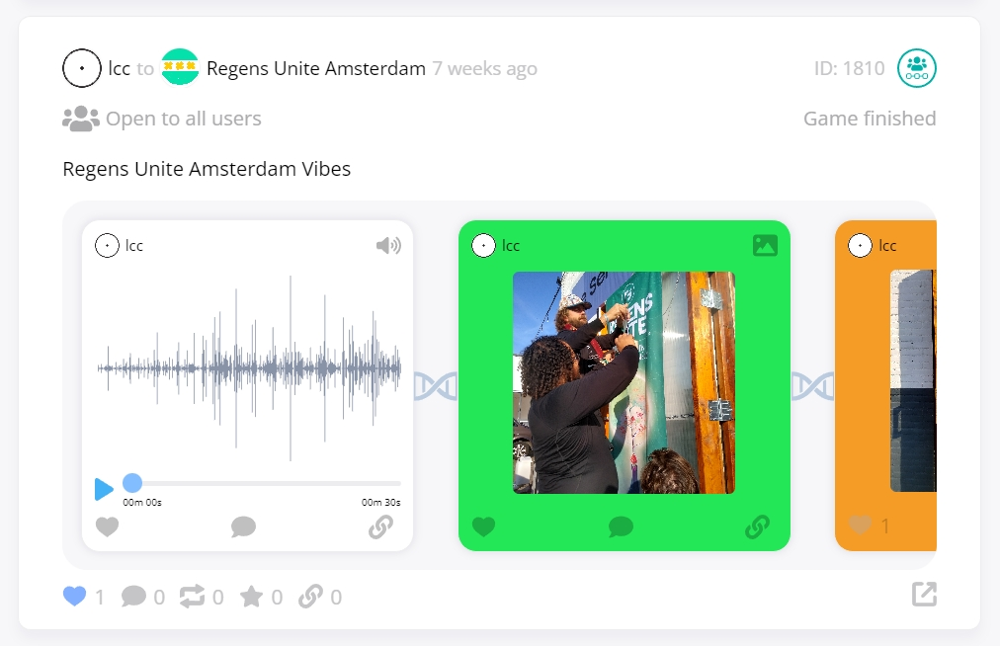

# Linking

While weco's [holonic framework](holonics.md) helps to reduce **spatial** fragmention in social containers, another problem that often arises for online communities is **temporal** fragmentation.

If you post something in a community today and then three months or a year later someone else posts something very relevant in the same community, even though it exists in the same location, the distance in time between them can make it hard for people to connect them together.

The only real way to notice those relationships is to keep track of everything passing the through the community in your memory and then search or scroll your way back to the earlier post. If you're new to the community or there are many related posts spread out across different times this task becomes even harder.

To address this problem and facilitate a more interconnected network we've built in the ability to create internal bidirectional links between content on weco.

At the moment they're only implemented on posts but we plan to allow connections to be made between spaces, users, comments, and other items as well, enabling complex knowledge graphs, weaving together related content across the entire platform, to evolve over time through collective user interactions.

To create a link between two posts you simply click on the link button below a post to open the link modal and enter the id of the other post you want to connect it to. You then also have the option to add a description of their relationship if you want.

Once connected, other users can then see the link attached to the post by opening the same link modal and navigate directly to that post.

The other post will also now contain a link back to the original post allowing navigation in both directions.

The link modal UI is very basic at the moment but we have plans to display more info about each post and its relationship with addtional filtering and search options.

If you switch over to the post map [lense](lenses.md) you can also see these links connecting the posts visualised on the graph.

Below is a zoomed out view of all the posts and links currently on the platform:

Using this approach, users are able to build up and explore networks of related content that would otherwise remain fragmented and much harder to find on other social networks.

To avoid clutter and improve the relevance of the links displayed to users, we also plan to allow users to [rate](ratings.md) links. We'll then rank and display or hide links based on their relevance, as judged by users in each community, and make it possible to search or filter links based on different metrics; providing even more control over the related content you're finding. The relevance of links could additionally be represented with visual cues like the thickness or colour of the links to help users make sense of the information.

When you arrive at any peice of content on the platform, you'll now have a range of recommended related content instantly available at your fingertips.

---

Another use of this linking system can be seen on [Glass Bead Game]() posts where beads (sub-posts) are linked together into a string of content:

