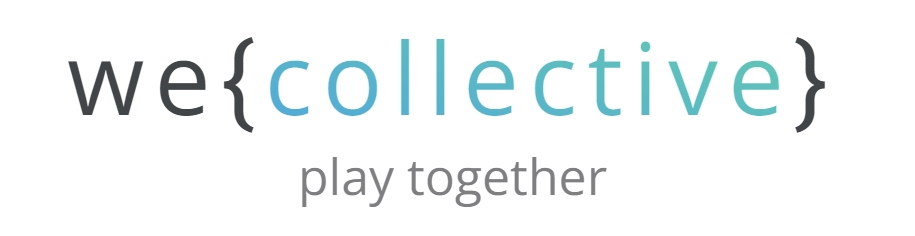

<!-- # we { collective } -->

<!-- #### Play Together -->

<!--  -->

<!--   -->

<!--  

 -->

## Intro

[weco.io](https://weco.io) is an evolving, [open source](https://github.com/wecollective), biomimetically inspired experiment in social network design, collective intelligence, and cooperative ownership.

The platform is built around a unique [interlinked](linking.md) [holonic](holonics.md) community framework modelled on the human brain and designed to help users connect, organise, build upon, remix, filter, and explore social content more efficiently.

A simple, albeit limited, way to summarise the basic design would be to describe it as a mix between the social dynamics of [Reddit](https://www.reddit.com/) and the organisational elements of [The Brain](https://www.thebrain.com/).

Within this framework a range of [post types](post-types.md), [community modules](organelles.md), and [lenses](lenses.md) are being developed to meet different collaborative needs for communities.

The common theme running through these features is a desire to explore and facilitate new scalable forms of collaboration and collective intelligence whilst shifting power back to users and content creators.

If enough people get involved we’ll be transitioning into a platform cooperative, owned and governed by its members. Members of the coop will then be able to propose and vote on new features they’d like built into the platform, as well as how surplus profits generated by the site are spent. Decision making will harness the governance tools being developed on the platform and evolve as these are further experimented with. Learn more about our plans for the coop and its governance [here](business.md) and [here](governance.md).

Internal market dynamics (with alignment incentives) will eventually be set up to incentivise ongoing evolvition of the design…

Being fully [open source](https://github.com/wecollective), anyone is welcome to fork the codebase, boot up their own instance of the platform, and work on their own version.

The initial goal for the project is to grow a sustainable social network generating enough revenue under cooperative ownership to cover maintainanse costs and expand development of the platform. Learn more about our revenue ideas [here](business.md).

The long term goals for the project are much larger and open ended. Our grand vision is to help seed a global brain for humanity, capable of solving global problems, binding global multipolar traps, and unleashing humanities potential for flourishing, by triggering the next meta-system transition towards a super-intelligent, self-regulation, global superorganism. Learn more about that in the [white-paper](whitepaper.md).

Contact...
