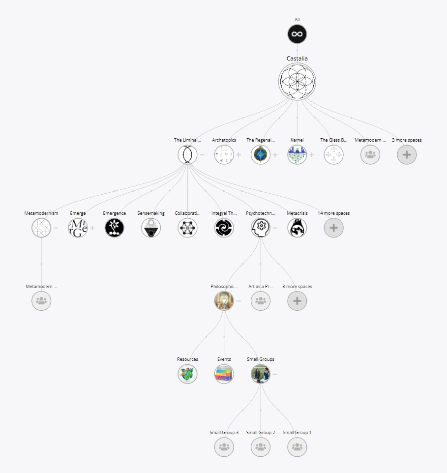
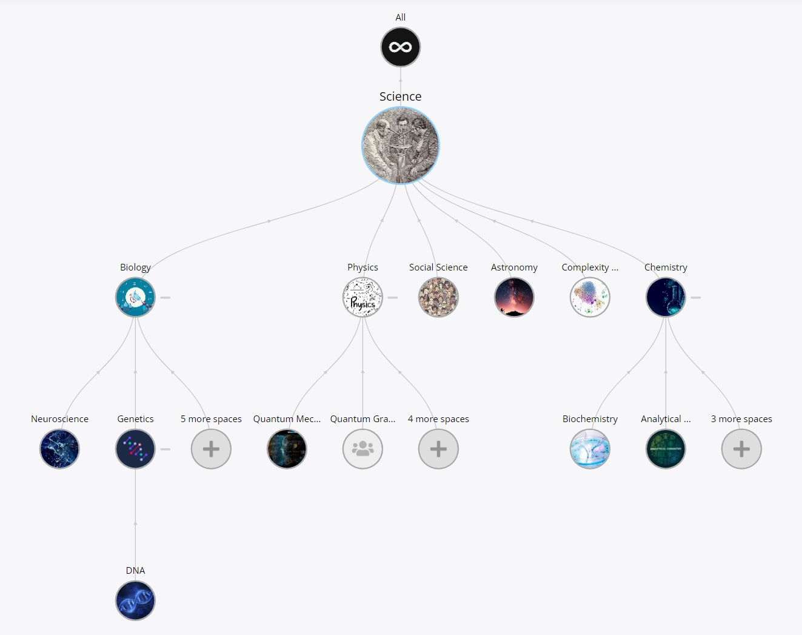
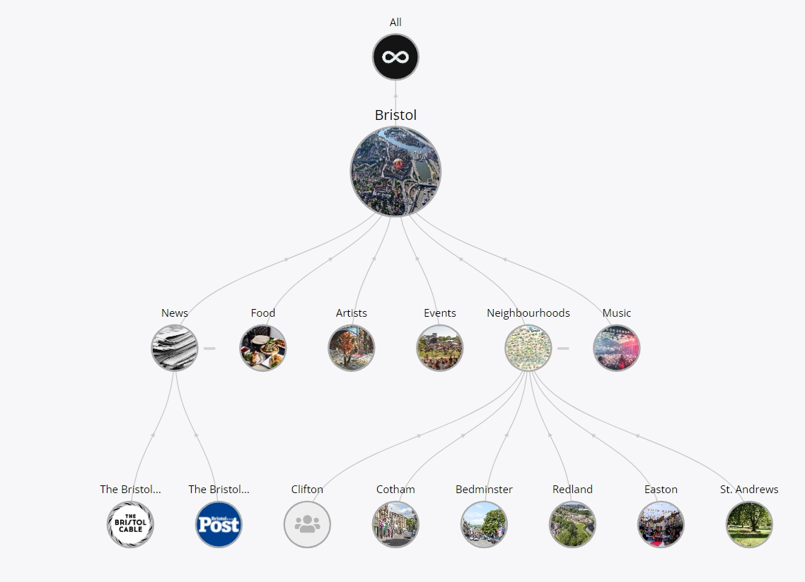
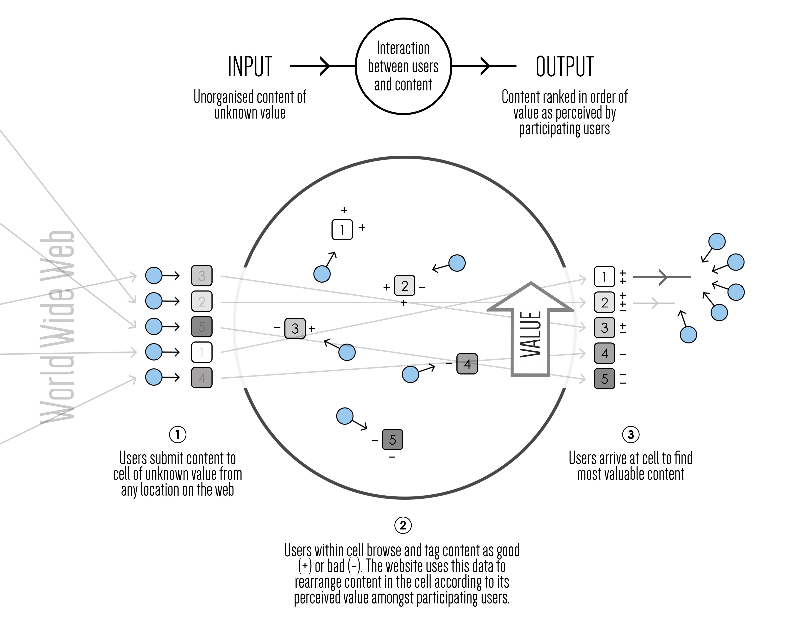
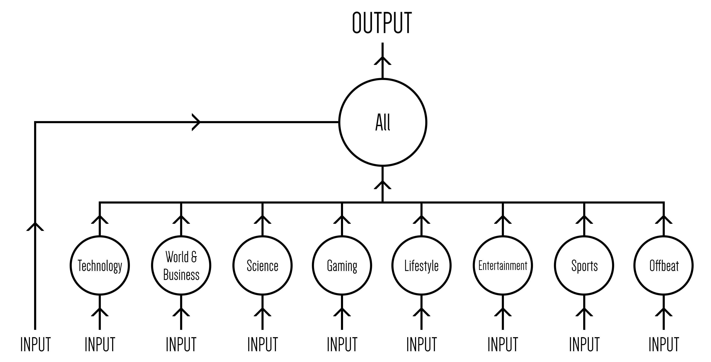
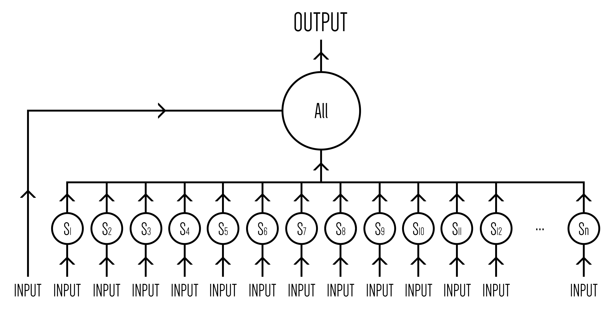
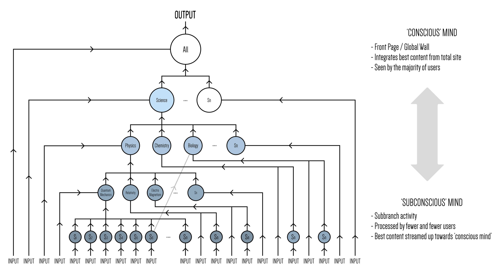
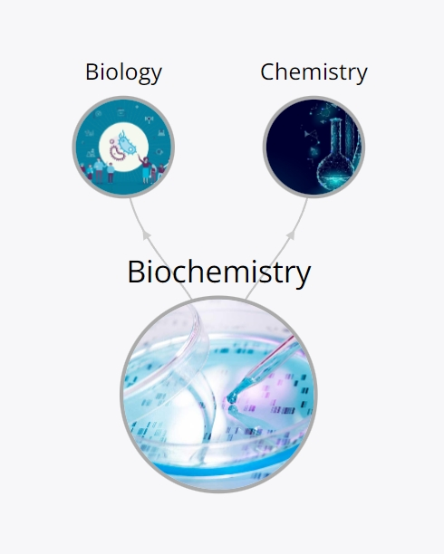
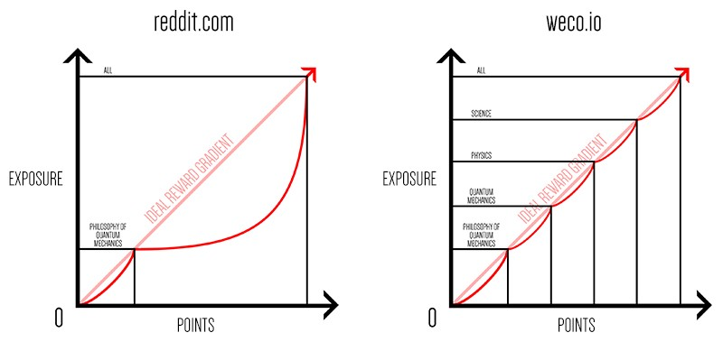

# Holonics

> _A holon (Greek: holos, 'whole' and -on, 'part') is something that is simultaneously a whole in and of itself, as well as a part of a larger whole. In other words, holons can be understood as the constituent part–wholes of a hierarchy. The holon represents a way to overcome the dichotomy between parts and wholes, as well as a way to account for both the self-assertive and the integrative tendencies of organisms.The term was coined by Arthur Koestler in The Ghost in the Machine (1967). In Koestler's formulations, a holon is something that has integrity and identity while simultaneously being a part of a larger system; it is a subsystem of a greater system._

One of the core unique features of weco is its [holonic](<https://en.wikipedia.org/wiki/Holon_(philosophy)>) organisational structure.

[summary video]

#### The Problem

<!--  -->

Up until now, social containers like _groups_, _communities_, or _subreddits_ on all the largest social networks have existed as fundamentally seperate locations on a single hierarchical level.

You can create as many of these containers as you like (horizontally) but it’s not possible to nest containers within each other (vertically).

It's a bit like a folder structure on a computer where you're free to create new folders and add content to them but, for reasons we'll get into, it’s not possible to add sub-folders.

In some cases, a predefined set of sub-containers like _Events_ or _Rooms_ on Facebook groups are included, or content can be subdivided by group hashtags as seen with Reddit's _flairs_, but custom multi-level nesting of containers hasn't been an option.

Depending on the size and purpose of the community, these predefined sub-containers and group hashtags may be adequete to meet organisational needs up to a point. But as communities grow in scale and complexity, or if they simply require a higher level of organisation, the restrictions inherant in this design can force unnecissary fragmentation and significantly limit group capacity.

To better understand the problem: imagine an example community that starts off with 10 individuals, each of whom posts one new item and view 10 other items a day.

Initially, everyone's able to see and respond to all the content flowing through that container. If different subjects come up that are more or less intersting to each individual, it's not an issue because they're all seeing everything and can choose to pay attention to the content that interests them.

But as the number of particpants grows the dynamic begins to shift. Once there are 100 individuals who all post and view content at that same rate, now each person is only able to see 10% of the content flowing through the community and, likewise, only 10% of the community will see their posts each day, and the larger the community grows the greater that gap of perception gets.

Ranking content by how many likes or up-votes it's recieved helps to some degree to sift out content that is more relevant to the community generally but it doesn't help if what you're interested in doesn't match the majoirty opinion and still suffers from the issue that voters are only seeing a fraction of the available content of interest to them so a lot of content is likely to slip through without gaining relevant views.

To find what you're looking for, you now either have to browse a lot more content, or use search queries and hashtags to reduce the scope of content you're seeing, both of which come with their own limitations: To search by text you already need to know fairly specifically what you're looking for (i.e direct quotes included in the content) so exploration by onotlogical categories is not possible. And while hashtags enable basic onotological categorisation of content, it only goes one level deep (you can't have a hashtag that contains other hashtags) so seperate but related groupings of content remain fragmented and must each be searched individually.

The result in most cases is that people just get used to seeing whatever is judged most popular by majority opinion or create splinter groups to discuss their more specific interests.

#### The Solution

To address these and other related issues weco has been designed from the ground up to enable unlimited nesting of social containers (a.k.a 'spaces').

This means it's possible to create an umbrella space for a large topic like [Science](https://weco.io/s/science/spaces) which contains sub-spaces within it for [Biology](https://weco.io/s/biology/spaces), [Chemisty](https://weco.io/s/chemistry/spaces), and [Physics](https://weco.io/s/physics/spaces), each of which can themselves contain as many further sub-space as they like, and so on, as deep as is useful to the community at large.

Similarly, a space could be created for a city like [Bristol](https://weco.io/s/bristol/spaces), which containes sub-spaces for [local neighborhoods](https://weco.io/s/bristol-neighbourhoods/spaces), or general interests within the city like [Bristol Food](https://weco.io/s/bristol-food/spaces), [Bristol Artists](https://weco.io/s/bristol-artists/spaces) etc.

And this same orgainisational logic can be applied to any ontological or community structure that's useful to users.

Every space in the resulting holarchies is a unique location with its own URL, moderators, and rules but remains integrated in its larger context, inheriting relevant constraints from its parents and flowing content back up to them.

---

Below are a series of digrams illustrating the evolution of social network containers leading up to weco's holonic organisational framework from a [cybernetic](https://en.wikipedia.org/wiki/Cybernetics) perspective.

Each social container could be seen as a kind of social cell/vessel, with inputs (content sharing), processing (interactions), and outputs (ranked/filtered content):

The first social news sites, like [Digg](https://digg.com/), had a fixed set of containers, each of which feed into the global container 'all':

Later, platforms like [Reddit](https://www.reddit.com/) introduced the ability to create containers for any subject users were interested in:

Weco now offers the ability to both create containers for any subject and nest them within each other to any depth:

---

## How it works

#### Multi-level Aggregation

In order to maintain integration across all these subdivisions, posts shared to (public) child spaces are aggregated together in each of their parents, all the way up the holarchy.

This means that a parent space like Bristol at the top, for example, integrates content not only shared directly there but to each of its contained child spaces at every level below in one location.

If you want to see the latest content from all Bristol related spaces, there's no longer any need to jump around through different splinter groups as you can see it all aggregated in one location. But if you want to narrow the scope of your focus, you can just as easily navigate down the holarchy to whichever space you're most interested in.

In this way you get the best of both worlds: the ability to differentiate content into intuitive ontological categories while still retaining a higher level of integration.

Note: We've included the option to toggle the depth of content included on each spaces feed in the filter settings so it's still possible to only view content directly posted to that space if desired. As such, no prior functionality is lost, you just have the additional option to integrated related subjects into a single feed as well.

#### Multi-locality

Another aspect of the design is that both posts and spaces can exist in multiple locations simultaneously.

Posts can be tagged with as many spaces as desired when created or reposted to new spaces after creation, causing them to show up in each location at the same time without the need for duplicates. Each instance of the post simply points back to the same entry in the database, helping to reduce unnecissary clutter wihtin the overall holarchy.

[image]

Spaces can also have multiple parents, allowing them to exist in many different locations at once.

One example in the current holarchy is the [Biochemistry](https://weco.io/s/biochemistry/spaces) space which exists in both [Biology](https://weco.io/s/biology) and [Chemistry](https://weco.io/s/chemistry), feeding its content into both.

#### Moderation

The creator of each space becomes its default moderator with the power to:

- Update the spaces settings (handle, name, description, flag image, and cover image)
- Invite or remove other mods
- Attach their own child spaces
- Accept or reject child space requests from other user
- Remove existing child spaces
- Attach their own parent spaces
- Send parent space requests to spaces created by other users (requires permission from their mods)
- Remove existing parent spaces

The provides a lot of flexibility within the design, granting creators of spaces the freedom to reorganise and/or relocate their holarchies as desired while retaining appropriate control over the content they have created.

Spaces can also be made private. Moderators can then send out invites or let users individually request access. All content shared within these spaces is hidden throughout the wider holarchy unless you have been granted access.

It's also possible to nest private spaces within each other, each having their own access rights, allowing for complex permission based architectures to be experimented with.

[image]

In the future we plan to add the following additional governance features:

- The ability for mods to easily remove unwanted posts in their spaces (coming soon!)
- The ability for users to flag posts with different labels (spam, NSFW, irrelevant etc.) to help mods manage their spaces content
- The ability for users of a space to self moderate content based on their individual preferences without the need for mods by setting thresholds for removal of content linked to the number of flags posts have recieved
- The ability to directly link governance decisions and space settings to democratic polls and other decision making tools on the platform
- The ability to define a range of different user roles within a space linked to unique permission sets
- The ability to set rules in spaces that propagate down the holarchy...
- DAO integration (Cosmos, Juno, DAODAO)

#### Competition and Natural Selection

As the number of spaces within a holarchy grows, displaying every space at every level all at once in the navigation view start to become cluttered so it makes sence to collapse parts of the holarchy initially and give users the option to expand them out based on what they're looking for. At the moment we display up to 7 child spaces of the first generation before an expander node is included telling you how many remaining spaces exist at the that level, and then up to 3 for each generation below (however, these are fairly arbitrary numbers that can easily be customised).

In order to make the first spaces that show up as relevant as possible, they're ranked like posts by various metrics. Currently the default view sorts the spaces from left to right by the total number of likes they contain, but other options include total posts, total followers, total reactions, total comments, total ratings, and the date they were created. Eventually we plan to allow spaces to choose their own default sorting algorithms or even design their own.

[gif image/video of changing filters]

An interesting property that emerges from this filtering approach is that it enables a decentralised/user driven natural selection process to unfold at each level of a holarchy, where spaces that are able to gain more traction (as measured by these metrics) are rewarded with increased visibility on the platform while unsued or inactive spaces, in contrast, sink down the listings, reducing their exposure.

Asa result, this built in competative dynamic not only increases the relevance of content being displayed to users but also helps to prevent stagnation within ontolgoies or blockages due to bad moderation, allowing the whole framework to fluidly adapt and evolve over time to better meet changing users needs.

Let's use the Science holarchy as an example to help illustrate how this might unfold in practice:

Imagine that the mods of [Science]() and most of its child spaces are doing a great job. The overall holarchy is functioning well. But, for whatever reason, the mods of the [Biology]() space start abusing their privillages by removing valuable content or supressing valuable contributors. If the fact that they created the first Biology space meant that they couldn't be replaced, the functionality and health of the whole Science holarchy could be effected by this one point of failure.

As mentioned in the [Moderation section]() above, the mods of the Science space could simply decide to detach the Biology space and set up a new one to replace it. That might be a valid response and sufficent to resolve the issue, however, it also really depends on the insight of the Science mods as it centralises full control into their hands.

Another, more bottom-up/decentralised approach, however, would be to allow rival spaces to co-exist simultaneously and compete for real-estate within the holarchy.

In this way, a new Biology space (or multiple new Biology spaces) could be created with different rules and mods as soon as users become unhappy with the inital one. People could then freely choose which space they want to share content in and interact with. Similarly Biology related child-spaces could also pick which parent Biology space they want to attach to. Over time the space that best meets users needs would now organically rise up the rankings, eventually assuming the default Biology position in the overall Science holarchy.

The mods of the Science space wouldn't need to make that decision on behalf of the community, they could instead allow experimentaion and user driven natural selection to decide for them.

This approach would also benefit from creating more space for divergent perspectives on Biology to co-exist, without forcing one approach down everyones throats.

Because this dynamic could unfold at every level of a holarchy simultaneously, entire complex multi-level ontologial frameworks are able to fluidly adapt and evolve naturally towards meeting users needs without the need for overbearing top-down centralised planning.

#### Improved exposure gradients

Another interesting advantage that emerges from holonic nesting of social containers is an improved exposure gradient for posts.

On social news platforms like Reddit, in order for a post to reach the front page of the site it needs to recieve a huge number of up-votes, and to acheive that it needs to be seen by an even larger number of users. This works well if you post something to one of the largest subreddits on the platform as the more upvotes it recieves the more users will see it and it can keep gaining traction in this way until it reaches the front page, where it is awarded the maximum exposure possible on the platform.

The problem arises if you post something equally interesting to a small niche subreddit. Imagine, for example, a subreddit for a specific topic like 'The Philosophy of Quantum Mechanics' with several hundred active users. Even if that post was so interesting that everyone who came across it immediatly upvoted it, it would never have a chance of reaching the front page of the whole site because the number of users viewing that subreddit is too small. After climbing to the top of its feed and reaching maximum exposure there, it has no further path of expansion by which it can gain more views and thus more upvotes. The only way it could continue to gain traction would be if it were then reposted in a larger sub.

This means that the content on the front page is almost entierly dominated by posts to the largest subreddits alone and lots of interesting content shared to smaller subreddits is lost to the majority of users, despite the fact that were they given the oportunity to see it they might actually like it more than the content from the larger subs.

In contrast, the holonic framework provides an incremental gradient of steps from small niche spaces up to the largest space 'all' (equievelent to the front page of Reddit). If a niche topic like 'The Philosophy of Quantum Mechanics' is nested in a larger holarchy (All > Science > Physics > Quantum Mechanics > The Philosophy of Quantum Mechanics) posts submitted there now have a kind of ladder/'exposure gradient' they can climb up all the way to the top, provided enough users up-vote it along the way.

When a post is first submitted to a niche space nested deep in a holarchy, it's most likely to show up on the front page of that space and less and less likely to show up on the front page of each parent space above it, as each higher parent space aggregates more and more posts. So its inital exposure is constrained to people most interested in that specific subject, where it will recieve the most relevant views. If they up-vote it enough there, however, it will then start to gain exposure in the first parent space above it, where it's now being seen by a larger number of users, with a slightly broader range of interests. If they up-vote it enough there, it will then start to move up the ranks of the next parent space above, where it will gain even more views from an even broader range of users, and so on all the way up the holarchy.

This not only makes it possible for a high quality post to a niche space to climb all the way up to the front page, enriching the platform as a whole, but also provides posts with a better gradient of relevant views along the way. The more popular a post gets, the more users, with an incrementally expanding range of interests, the post is exposed to.

The image below contrasts this exposure vs. up-vote gradient for posts to small containers on Reddit with weco.

### Summary of Advantages

To quickly recap, the advantages of the holonic architecture could be summarised as follows:

For users browsing content:

- It's now easier and more intuitive to explore your way through large communities and find areas you may never otherwise have come across
- You have more control over the scope of your focus as you browse, being able to expand and contract the range of content you're viewing by jumping up and down the holarchy
- You're no longer forced to wade though as much irrelevant content in each community that you're not interested in
- You're less likely to come across duplicate reposts of the same content
- The content you see on the front page of the site (or nay level below in the holarchy) is no longer dominated by posts only to the largest sub-containers but includes a richer diverity of subjects

For content creators:

- It's easier to know where to post your content so that it ... more likely to recieve relevant views on your content because its now more often being found by people interested in that specific subject, rather than a random spread of everyone in the community
- If you post something to a nich sub-space, it now has the potential to keep gaining traction until it reaches the front page and recieves a better balance of relevant views along the way

For communities at large:

- As your community expands and the diversity of interests within it grows, it's no longer necissary to fracture into splinter groups or be bound by the tyrany of the majority with endless soverlapping threads, as custom subspaces, each with their own access permissions and governance, can be set up for every interest group while retaining an overarching unity.
- Complex nested governance structures can be set up to meet any custom orgainsational needs
- Ontological organisation can evolve organically in response to user interactions, rather than needing to be centrally planned.

## Technical implementation

Given all these advantages, the fact that we're so used to nesting containers in computer file systems, and that it seems to be how our brains are wired to work, you might wonder why holonic social architectures haven't been implemented yet...

It could in part be simply because enough people haven't considered it as a possibility yet. They're used to the constraints they've been given and the idea of nesting social containers just isn't on their radar.

Another possibility is that it's been considered by some of the larger platforms but discarded as an unnecissary or problematic innovation. The way they've structured their platforms has worked well for them up until now and so taking the time and/or risk to develop a new organisational structure just isn't a priority.

One of the central reasons it may have been disgarded as problematic is due to the problem of _recusive queries_ when approaching multi-level aggregation.

If content only exists on a single hierarchical level, querying posts from a database is relatively simple.

You can create a table for containers that looks a bit like this:

[image]

id, name, data...

1, Science, ...

2, Biology, ...

2, Politics, ...

And a table for posts that looks like this, where each entry references the container they exist within:

[image]

id, conatinerId, data...

1, 1, ...

2, 1, ...

3, 2, ...

To get the posts for a given conatiner, you now just need to request all posts with that conatiners id.

To find all the posts in Science, for example, you search for each post with id: 1: ...

Once you introduce holonic nesting, however, it suddenly gets a lot more complicated.

If Science now integrates Biology, Chemistry, and Physics, each of which contain their own child-spaces, and so on to any level of depth, you run into the problem of recursive queries.

To get all the posts that should show up in Science, it's no longer enough to search for posts that include id: 2, you now also have to grab posts with id: 3, id: 4 and so on.

To keep track of these relationships you could create an additional table called something like 'parent relationhsips':

id, parentId, childId

1, 1, 2

2, 2, 3

...

Using this table you can now work out that Science includes ... and that Biology includes... etc. so you can figure out which ids to include in your query.

The problem is that you now need to run recursive queries each time you request posts. First you need to grab all the child spaces of Science, then you need to grab each of their child spaces, and so on until you've gathered up all the relevant ids. Only then can you know which space ids to include in your post search.

This wouldn't be a problem if the holarchy only went a few levels deep or had a relatively small number of conatiners, but the larger holarchies grow, the more expensive and time consuming these queries become.

To solve this problem and avoid recusive queries altogether, weco uses another table to keep track of ancestor relationships:

id, ancestor, descendent

1, 1, 2

2, 2, 3

...

When a new child space is created or attached to a parent, it inherits all of that parents ancestors.

If ... is attached to ... new entries are added to the table for each inherited ancestor.

It's now possible to work out all the ancestors of a given space with a simple query. You just need to search this table for entries with ... and you can find a list of all the ... ids..

Instead of running this query every time posts are requested, it's done only once, when posts are submitted.

When a new post is added to a space, its ancestors are queried at that point and, instead of just linking it to that space, it also links it to each of those ancestors.

example: ...

To find all the posts in Science, you're now back to the simple solution of searching for posts with that matching id...

Provided you keep the ancestor relationships up to date, this makes holonic multi-level aggregation possible without the need for expensive recursive queries.

[diagrams]

Another challenge arises, however, when you want to update the organisation of a holarchy...
